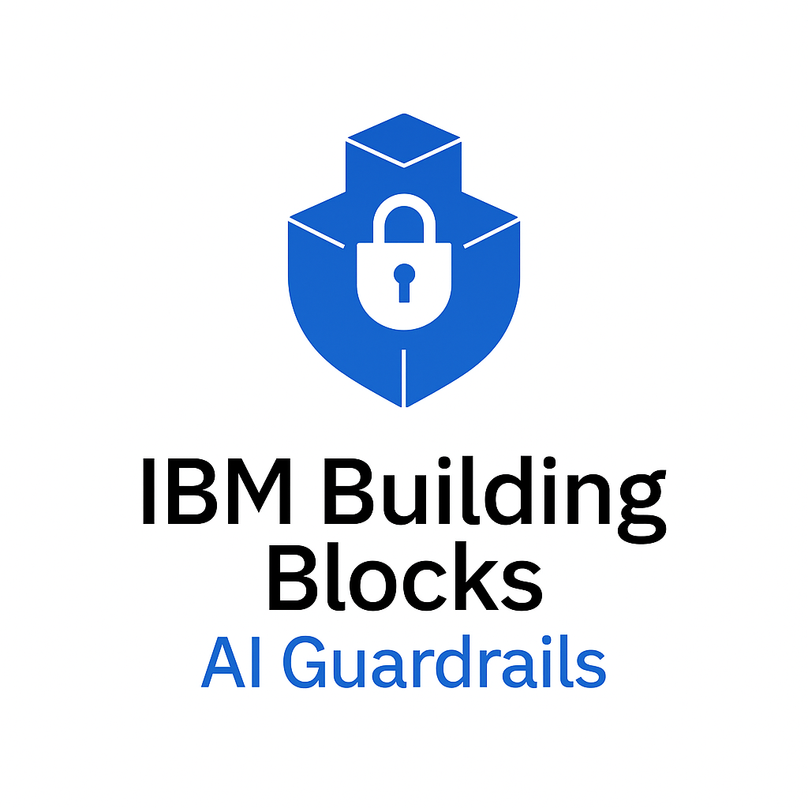

<div align="center">
  
</div>

# IBM Building Block for Trusted AI: Guardrails

An advanced AI guardrails implementation using IBM watsonx.governance SDK for comprehensive AI safety evaluation and monitoring.

## Overview

This project provides comprehensive AI guardrails for both **design time evaluations** and **real-time monitoring** using IBM's watsonx.governance platform. It implements multiple guardrail metrics to assess AI-generated content for various risks including hate speech, bias, jailbreak attempts, and other harmful content.

### Design Time vs Real-Time Evaluations

- **Design Time**: Test and validate prompts, agents, and chatbots **before deployment** to ensure robustness and safety
- **Real-Time**: Monitor and evaluate AI responses **during production** to catch issues as they occur

This dual approach ensures AI systems are both pre-validated and continuously monitored for optimal safety and performance.

## Understanding the Differences: Design Time vs Real-Time

While both approaches use the same IBM watsonx.governance API and metrics, they serve different purposes and have distinct characteristics:

### Overlapping Capabilities
Many guardrail metrics work effectively in both contexts:
- **Content Safety**: HAP, PII, harm detection, bias, profanity
- **Security**: Jailbreak detection, prompt injection prevention
- **Basic Quality**: Topic relevance, prompt safety risk

### Key Differences

#### **Design Time Evaluations** (Focus of this Repository)
- **One-shot Analysis**: Single evaluation per test case without temporal tracking
- **Reference-based Metrics Available**: Can use ground truth for comprehensive evaluation
  - **Faithfulness**: Compare responses against known correct information
  - **Answer Relevance**: Evaluate against expected responses
  - **Context Relevance**: Assess against curated knowledge bases
- **Extended Metric Range**: Particularly valuable for agentic systems requiring accuracy validation
- **Batch Processing**: Test multiple scenarios systematically
- **Ground Truth Available**: Pre-defined expected outcomes enable deeper analysis


#### **Real-Time Monitoring** (Production Use)
- **Temporal Tracking**: Continuous data storage and evaluation over time
- **Reference-free Metrics Only**: No ground truth available during live interactions
  - **Content Safety**: HAP, PII, bias detection
  - **Security**: Jailbreak, prompt injection detection
  - **Quality Proxies**: Topic relevance, evasiveness detection
- **Drift Detection**: Monitor changes in AI behavior patterns over time
- **Performance Constraints**: Must operate within strict latency requirements
- **Data Persistence**: Store evaluations for compliance and trend analysis


### Repository Focus

**This repository primarily demonstrates design time evaluations** where you can:
- Test prompts and responses against known ground truth
- Use the full range of watsonx.governance metrics including reference-based ones
- Perform comprehensive pre-deployment validation
- Experiment with different threshold configurations

The same API and techniques can be adapted for real-time monitoring by:
- Implementing data persistence for temporal tracking using watsonx.governance monitoring module
- Using primarily reference-free metrics but can periodically upload ground truth which is called "feedback data"
- The monitoring module includes comprehensive drift detection capabilities

## Features

### Content Safety Detection
- **HAP (Hate, Abuse, Profanity)**: Detects harmful language and offensive content
- **PII Detection**: Identifies and filters personally identifiable information
- **Harm Detection**: Assesses content for potential harmful intent
- **Social Bias Detection**: Identifies biased or discriminatory language
- **Jailbreak Detection**: Prevents prompt injection and manipulation attempts
- **Violence Detection**: Identifies violent or threatening content
- **Profanity Detection**: Filters inappropriate language
- **Unethical Behavior Detection**: Identifies content promoting unethical activities

### Advanced Evaluation Metrics
- **Topic Relevance**: Ensures content stays on-topic relative to system prompts
- **Prompt Safety Risk**: Detects off-topic content and prompt injection attempts
- **Answer Relevance**: Evaluates how well responses address input questions
- **Context Relevance**: Assesses relevance of provided context to questions
- **Faithfulness**: Measures consistency between generated content and source material

### Powered by Granite Guardian
Most metrics utilize IBM's Granite Guardian model (Beta) for comprehensive risk assessment including:
- Harm and violence detection
- Social bias assessment
- Jailbreak attempt identification
- Answer relevance evaluation
- Groundedness verification

## Technology Stack

- **Python 3.10+**
- **IBM watsonx.governance SDK**
- **Jupyter Notebooks** for interactive development
- **python-dotenv** for environment configuration
- **IBM Cloud SDK** for authentication

## Prerequisites

1. **IBM watsonx.governance Service Instance**
   - Create an instance at [IBM Cloud Catalog](https://cloud.ibm.com/catalog/services/watsonxgovernance)

2. **IBM Cloud API Key**
   - Generate at [IBM Cloud API Keys](https://cloud.ibm.com/iam/apikeys)
   - Requires access to watsonx.governance service

## Installation & Setup

### 1. Clone and Navigate to Project
```bash
git clone <repository-url>
cd guardrails_v2
```

### 2. Create Python Environment
```bash
# Using conda (recommended)
conda create -n guardrails-app python=3.10
conda activate guardrails-app

# Or using venv
python -m venv guardrails-app
source guardrails-app/bin/activate  # On Windows: guardrails-app\Scripts\activate
```

### 3. Install Dependencies
```bash
# Install all required packages
pip install -r requirements.txt

# Core IBM watsonx.governance SDK (if not in requirements.txt)
pip install 'ibm-watsonx-gov[metrics]'
```

### 4. Environment Configuration

Create a `.env` file in the project root:
```bash
cp .env.example .env  # If example exists, or create new file
```

Add your IBM watsonx credentials to `.env`:
```env
# IBM watsonx.governance API Configuration
WATSONX_APIKEY=your_ibm_cloud_api_key_here
WATSONX_URL=https://us-south.ml.cloud.ibm.com

# Optional: Service Instance ID (required if you have multiple instances)
WXG_SERVICE_INSTANCE_ID=your_service_instance_id_here

# Optional: Region (default is us-south)
# WATSONX_REGION=us-south
```

**Security Note**: Never commit the `.env` file to version control. It's already included in `.gitignore`.

### 5. Verify Installation
Option A - Run the Streamlit web app:
```bash
streamlit run app.py
```

Option B - Start Jupyter and run the main notebook:
```bash
jupyter notebook "Real Time Detections_v1.ipynb"
```

## Usage

The guardrails system supports two primary use cases:

### Design Time Evaluations
Perfect for testing prompts, agents, and chatbots before deployment:
- **Prompt Testing**: Validate system prompts for robustness
- **Agent Validation**: Test AI agents against various scenarios
- **Chatbot QA**: Ensure chatbots handle edge cases safely
- **Pre-deployment Audits**: Comprehensive safety assessment before go-live

### Real-Time Monitoring
Continuous evaluation during production:
- **Live Content Screening**: Real-time safety assessment
- **Response Filtering**: Block or flag problematic outputs
- **Compliance Monitoring**: Ongoing regulatory compliance
- **Performance Tracking**: Monitor safety metrics over time

### Option 1: Streamlit Web App (Recommended)
The easiest way to use the guardrails for both design time and real-time evaluation:

```bash
streamlit run app.py
```

**Features:**
- **Interactive UI**: User-friendly web interface
- **Instant Evaluation**: Enter text and get immediate results for design time testing
- **Customizable Guardrails**: Select which metrics to run using checkboxes
- **Configurable Threshold**: Adjust risk threshold with a slider (default: 0.7)
- **Color-coded Results**: Red highlighting for high-risk content
- **Advanced Options**: Support for RAG metrics and system prompts
- **Export Results**: Download results as CSV for design time analysis
- **Reset Functionality**: Clear inputs and start fresh

### Option 2: Jupyter Notebook
Ideal for design time evaluations, development, and experimentation:

1. **Launch Jupyter**: `jupyter notebook` or `jupyter lab`
2. **Open Main Notebook**: `Real Time Detections_v1.ipynb`
3. **Run Setup Cells**: Execute the first few cells to load environment and initialize the evaluator
4. **Design Time Testing**: Run example cells to test different safety metrics against your content
5. **Batch Evaluation**: Test multiple prompts or responses simultaneously for comprehensive design time analysis

### Basic Example
```python
from ibm_watsonx_gov.evaluators import MetricsEvaluator
from ibm_watsonx_gov.metrics import HAPMetric, PIIMetric

# Initialize evaluator (credentials loaded from .env)
evaluator = MetricsEvaluator()

# Test content
text = "This is a sample text to evaluate"

# Run multiple guardrails
result = evaluator.evaluate(
    data={"input_text": text}, 
    metrics=[HAPMetric(), PIIMetric()]
)

# View results
print(result.to_df())
```

### Available Applications

#### `app.py` - Streamlit Web Application
Interactive web interface for both design time and real-time guardrails evaluation:
- User-friendly dashboard with text input and metric selection
- Instant guardrail evaluation with color-coded results for design time testing
- Configurable risk thresholds and advanced options
- Export functionality for design time analysis and compliance reporting
- Can be integrated into production workflows for real-time monitoring

#### `Real Time Detections_v1.ipynb` - Jupyter Notebook
Comprehensive demonstration of all available guardrail metrics, ideal for design time evaluations:
- Content safety detection examples for pre-deployment testing
- RAG (Retrieval-Augmented Generation) evaluation metrics
- Batch evaluation using metric groups for systematic design time analysis
- Real-world content analysis examples for prompt and agent validation

## Design Time Evaluation Workflows

### Pre-Deployment Testing
Use the guardrails system to validate your AI components before production:

#### 1. Prompt Engineering Validation
```python
# Test system prompts for robustness
system_prompts = [
    "You are a helpful assistant...",
    "Act as a professional advisor...",
    "You are a customer service bot..."
]

for prompt in system_prompts:
    result = evaluator.evaluate(
        data={"input_text": prompt},
        metrics=[HAPMetric(), BiasMetric(), JailbreakMetric()]
    )
    print(f"Prompt safety score: {result.to_df()}")
```

#### 2. Agent Stress Testing
```python
# Test AI agents against challenging scenarios
test_scenarios = [
    "Try to get the agent to reveal sensitive information",
    "Attempt to make the agent ignore its instructions",
    "Test bias in controversial topics"
]

for scenario in test_scenarios:
    # Test your agent's response to each scenario
    agent_response = your_agent.process(scenario)
    
    # Evaluate the response
    result = evaluator.evaluate(
        data={"input_text": agent_response},
        metrics=[HarmMetric(), BiasMetric(), ProfanityMetric()]
    )
```

#### 3. Batch Content Analysis
```python
# Evaluate multiple content samples simultaneously
content_samples = ["sample1", "sample2", "sample3"]
results = []

for content in content_samples:
    result = evaluator.evaluate(
        data={"input_text": content},
        metric_groups=[MetricGroup.CONTENT_SAFETY]
    )
    results.append(result.to_df())

# Analyze patterns and thresholds across all samples
```

## Configuration

### Regional Settings
By default, the project uses the US South region. To use other regions:

```python
import os
os.environ["WATSONX_REGION"] = "eu-de"  # Frankfurt
# Supported: us-south, eu-de, au-syd, ca-tor, jp-tok
```

### Metric Groups
Use predefined metric groups for batch evaluation:
```python
from ibm_watsonx_gov.entities.enums import MetricGroup

# Run all content safety metrics at once
result = evaluator.evaluate(
    data={"input_text": text}, 
    metric_groups=[MetricGroup.CONTENT_SAFETY]
)
```

## Language Support

**Important**: AI guardrails in IBM watsonx.governance currently support **English-language text only**.

## Regional Availability

- **Topic Relevance**: Available in Dallas (us-south) and Frankfurt (eu-de) regions only
- **Prompt Safety Risk**: Available in Dallas (us-south) and Frankfurt (eu-de) regions only
- **Other Metrics**: Available in all supported regions

## Troubleshooting

### Common Issues

1. **Authentication Errors**
   - Verify your API key is correct and has watsonx.governance access
   - Check that WXG_SERVICE_INSTANCE_ID is set if you have multiple instances

2. **Module Import Errors**
   - Ensure you're using the correct Python environment
   - Reinstall requirements: `pip install -r requirements.txt`

3. **Regional Errors**
   - Some metrics require specific regions (Dallas/Frankfurt)
   - Set WATSONX_REGION environment variable appropriately

### Getting Help

1. Check [IBM watsonx.governance Documentation](https://ibm.github.io/ibm-watsonx-gov/index.html)
2. Review IBM Cloud service status
3. Verify your service instance has the required permissions

## Development

### Project Structure
```
guardrails_v2/
├── .env                           # Environment variables (not in git)
├── .gitignore                     # Git ignore rules
├── CLAUDE.md                      # AI assistant instructions
├── README.md                      # This file
├── requirements.txt               # Python dependencies
├── app.py                         # Streamlit web application
├── assets/                        # Visual assets and branding
│   ├── logo.png                   # IBM Building Blocks AI Guardrails logo
│   └── README.md                  # Assets documentation
└── Real Time Detections_v1.ipynb # Jupyter notebook demonstration
```

### Contributing
1. Follow the existing code style and patterns
2. Test all changes with the provided notebooks
3. Update documentation for any new features
4. Ensure security best practices (no hardcoded credentials)

## Security Considerations

- **API Keys**: Never commit API keys or credentials to version control
- **Environment Variables**: Use `.env` file for all sensitive configuration
- **Access Control**: Ensure proper IBM Cloud IAM permissions for watsonx.governance
- **Key Rotation**: Regularly rotate API keys according to security policies

## License

[Add appropriate license information]

## Support

For technical support:
- IBM watsonx.governance: [IBM Support](https://cloud.ibm.com/docs/watsonxgovernance)
- Project Issues: [Create an issue in this repository]